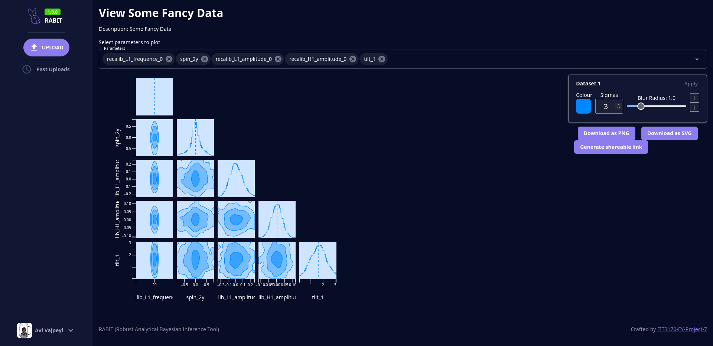

# Robust Analytical Bayesian Inference Tool (RABIT)

An online data visualisation toolkit for Bayesian parameter estimation data.

## Features

- Modern web-based interface
- Easy to use
- Share your plots easily
- Free and open source (ISC licensed)

## Screenshots

Visualise page:

## Installation

See [installation section of the documentation](https://megascrapper.github.io/rabit-docs/admin-guide/running-your-own-instance.html)

## Documentation

<https://megascrapper.github.io/rabit-docs/>

The repository for documentation is located at <https://github.com/megascrapper/rabit-docs>

## Contributing

Refer to the [contributions document](CONTRIBUTING.md).

## Licence

Refer to the [ISC license file](LICENSE.md).
