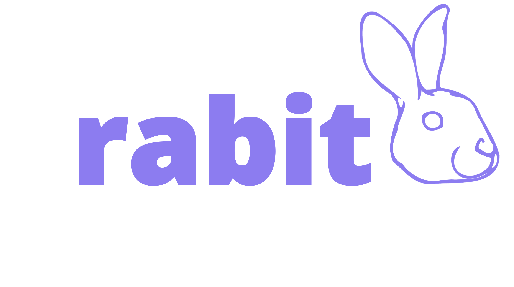
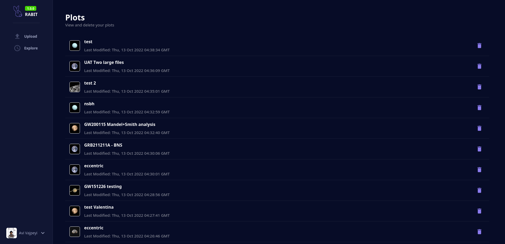
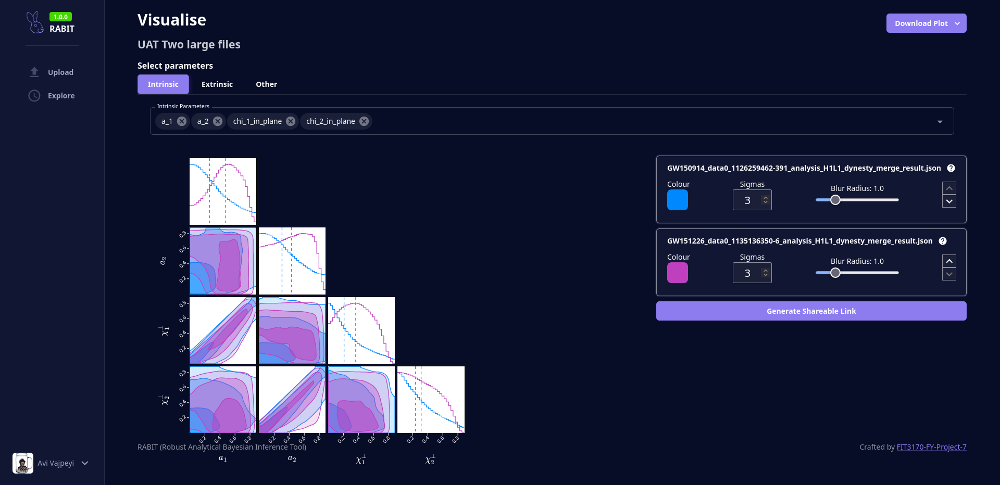
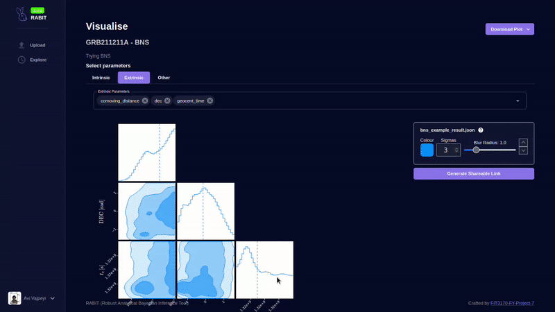
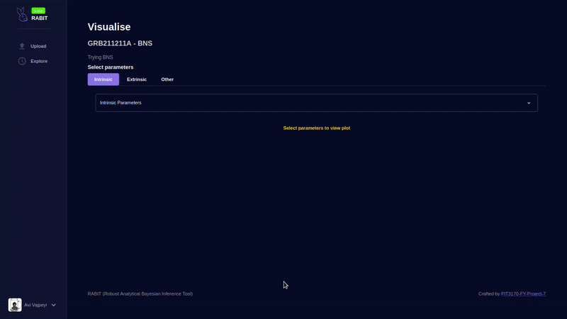
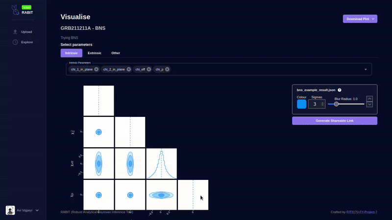
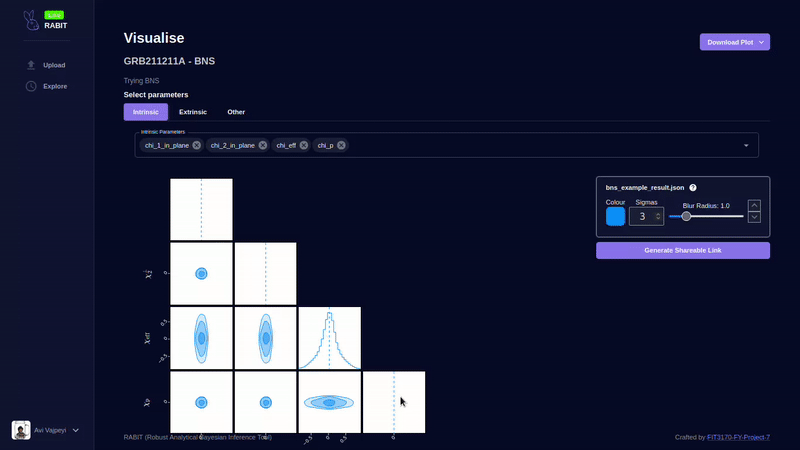

# Robust Analytical Bayesian Inference Tool (RABIT)

<!-- ALL-CONTRIBUTORS-BADGE:START - Do not remove or modify this section -->

<!-- ALL-CONTRIBUTORS-BADGE:END -->

<!-- markdownlint-disable MD033 -->

  

<!-- markdownlint-restore -->

An online data visualisation toolkit for Bayesian parameter estimation data.

## Features

- Modern web-based interface
- Easy to use
- Share your plots easily by creating a shareable link
- Export your plots as PNG or SVG
- Free and open source (ISC licensed)

## Screenshots

Explore page - contains list of uploaded data:

Visualise page:

Changing plot blur radius and colours:

Adding and removing parameters on the fly:

Generate a shareable, persistent link for the current plot:

Export plots to PNG and SVG:

## Installation

See [installation section of the documentation](https://fit3170-fy-project-7.github.io/RABIT-DOCS/admin-guide/running-your-own-instance.html)

## Documentation

<https://github.com/FIT3170-FY-Project-7/RABIT-DOCS>

The repository for documentation is located at <https://github.com/megascrapper/rabit-docs>

## Contributing

Refer to the [contributing to RABIT section of the documentation](https://fit3170-fy-project-7.github.io/RABIT-DOCS/dev-guide/contributing.html).

## Licence

Refer to the [ISC license file](LICENSE.md).

## Contributors ✨

Thanks goes to these wonderful people ([emoji key](https://allcontributors.org/docs/en/emoji-key)):

<!-- ALL-CONTRIBUTORS-LIST:START - Do not remove or modify this section -->
<!-- prettier-ignore-start -->
<!-- markdownlint-disable -->
<table>
  <tr>
    <td align="center"><a href="https://linkedin.com/in/vajpeyi/"> <b>Avi Vajpeyi</b></a> <a href="#mentoring-avivajpeyi" title="Mentoring">🧑‍🏫</a></td>
    <td align="center"><a href="https://github.com/AaditBhuwalka"> <b>AaditBhuwalka</b></a> <a href="https://github.com/FIT3170-FY-Project-7/RABIT-COMMON/commits?author=AaditBhuwalka" title="Code">💻</a></td>
    <td align="center"><a href="https://github.com/adam23232323"> <b>Adam</b></a> <a href="https://github.com/FIT3170-FY-Project-7/RABIT-COMMON/commits?author=adam23232323" title="Code">💻</a></td>
    <td align="center"><a href="https://github.com/bevanlewis"> <b>Bevan Lewis</b></a> <a href="https://github.com/FIT3170-FY-Project-7/RABIT-COMMON/commits?author=bevanlewis" title="Code">💻</a></td>
    <td align="center"><a href="https://github.com/Brittank88"> <b>Brittank88</b></a> <a href="https://github.com/FIT3170-FY-Project-7/RABIT-COMMON/commits?author=Brittank88" title="Code">💻</a> <a href="#infra-Brittank88" title="Infrastructure (Hosting, Build-Tools, etc)">🚇</a> <a href="#design-Brittank88" title="Design">🎨</a></td>
    <td align="center"><a href="https://github.com/Daniel-W-230"> <b>Daniel-W-230</b></a> <a href="https://github.com/FIT3170-FY-Project-7/RABIT-COMMON/commits?author=Daniel-W-230" title="Code">💻</a></td>
    <td align="center"><a href="https://github.com/ddes0015"> <b>ddes0015</b></a> <a href="https://github.com/FIT3170-FY-Project-7/RABIT-COMMON/commits?author=ddes0015" title="Code">💻</a></td>
  </tr>
  <tr>
    <td align="center"><a href="https://github.com/JMSS-Unknown"> <b>JMSS-Unknown</b></a> <a href="https://github.com/FIT3170-FY-Project-7/RABIT-COMMON/commits?author=JMSS-Unknown" title="Code">💻</a> <a href="#infra-JMSS-Unknown" title="Infrastructure (Hosting, Build-Tools, etc)">🚇</a> <a href="https://github.com/FIT3170-FY-Project-7/RABIT-COMMON/pulls?q=is%3Apr+reviewed-by%3AJMSS-Unknown" title="Reviewed Pull Requests">👀</a></td>
    <td align="center"><a href="https://github.com/jpit0004"> <b>jpit0004</b></a> <a href="https://github.com/FIT3170-FY-Project-7/RABIT-COMMON/commits?author=jpit0004" title="Code">💻</a></td>
    <td align="center"><a href="https://github.com/Markichu"> <b>Marcus Fox</b></a> <a href="https://github.com/FIT3170-FY-Project-7/RABIT-COMMON/commits?author=Markichu" title="Code">💻</a></td>
    <td align="center"><a href="https://github.com/megascrapper"> <b>Akbar Fadiansyah</b></a> <a href="https://github.com/FIT3170-FY-Project-7/RABIT-COMMON/commits?author=megascrapper" title="Code">💻</a> <a href="#infra-megascrapper" title="Infrastructure (Hosting, Build-Tools, etc)">🚇</a> <a href="https://github.com/FIT3170-FY-Project-7/RABIT-COMMON/commits?author=megascrapper" title="Documentation">📖</a></td>
    <td align="center"><a href="https://github.com/rale0002"> <b>rale0002</b></a> <a href="https://github.com/FIT3170-FY-Project-7/RABIT-COMMON/commits?author=rale0002" title="Code">💻</a></td>
    <td align="center"><a href="https://github.com/RHackers-00"> <b>RHackers-00</b></a> <a href="https://github.com/FIT3170-FY-Project-7/RABIT-COMMON/commits?author=RHackers-00" title="Code">💻</a> <a href="#projectManagement-RHackers-00" title="Project Management">📆</a></td>
    <td align="center"><a href="https://github.com/RohitRajeshh"> <b>RohitRajeshh</b></a> <a href="https://github.com/FIT3170-FY-Project-7/RABIT-COMMON/commits?author=RohitRajeshh" title="Code">💻</a></td>
  </tr>
  <tr>
    <td align="center"><a href="https://github.com/Teg64"> <b>Teg64</b></a> <a href="https://github.com/FIT3170-FY-Project-7/RABIT-COMMON/commits?author=Teg64" title="Code">💻</a> <a href="#infra-Teg64" title="Infrastructure (Hosting, Build-Tools, etc)">🚇</a> <a href="#projectManagement-Teg64" title="Project Management">📆</a> <a href="https://github.com/FIT3170-FY-Project-7/RABIT-COMMON/pulls?q=is%3Apr+reviewed-by%3ATeg64" title="Reviewed Pull Requests">👀</a></td>
    <td align="center"><a href="https://github.com/TONG0006"> <b>Timothy Ongko</b></a> <a href="https://github.com/FIT3170-FY-Project-7/RABIT-COMMON/commits?author=TONG0006" title="Code">💻</a></td>
    <td align="center"><a href="https://github.com/VenuraWe"> <b>VenuraWe</b></a> <a href="https://github.com/FIT3170-FY-Project-7/RABIT-COMMON/commits?author=VenuraWe" title="Code">💻</a> <a href="#projectManagement-VenuraWe" title="Project Management">📆</a></td>
    <td align="center"><a href="https://github.com/Viny143"> <b>Viny143</b></a> <a href="https://github.com/FIT3170-FY-Project-7/RABIT-COMMON/commits?author=Viny143" title="Code">💻</a></td>
  </tr>
</table>

<!-- markdownlint-restore -->
<!-- prettier-ignore-end -->

<!-- ALL-CONTRIBUTORS-LIST:END -->

This project follows the [all-contributors](https://github.com/all-contributors/all-contributors) specification. Contributions of any kind welcome!
